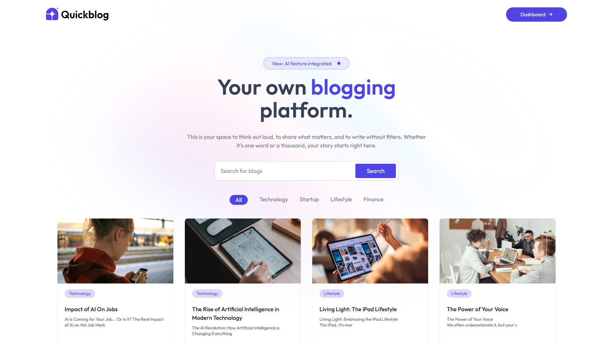
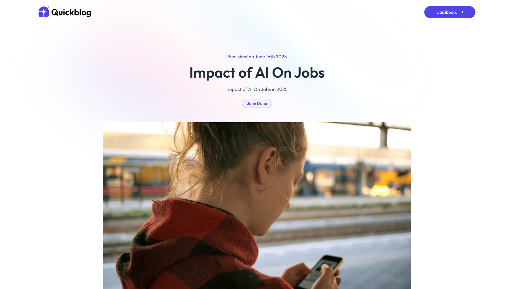

# 📝 QuickBlog - Modern Blogging Platform

[](https://quick-blog-zeta-two.vercel.app/)
[](LICENSE)
[](https://nodejs.org/)
[](https://reactjs.org/)

> 🚀 A modern, AI-powered blogging platform built with React, Node.js, and Express. Create, manage, and share your stories with an intuitive admin panel and seamless user experience.

## 📸 Screenshots

| Homepage | Blog Details |
|----------|--------------|
|  |  |

## ✨ Features

### 🎯 Core Features

- 📰 **Dynamic Blog Creation** - Rich text editor with Quill.js
- 🤖 **AI Content Generation** - Powered by Google Gemini AI
- 🎨 **Modern UI/UX** - Beautiful, responsive design with Tailwind CSS
- 📱 **Mobile-First** - Fully responsive across all devices
- 🔍 **Smart Search** - Real-time blog search functionality
- 📂 **Category Management** - Organize blogs by categories
- 💬 **Comment System** - User engagement with moderation

### 🔐 Admin Panel

- 🛡️ **Secure Authentication** - JWT-based admin login
- 📊 **Dashboard Analytics** - Blog statistics and insights
- ✏️ **Content Management** - Create, edit, delete blogs
- 📋 **Blog List Management** - Publish/unpublish functionality
- 💬 **Comment Moderation** - Approve or delete comments
- 🖼️ **Image Upload** - ImageKit integration for optimized images

### 🎪 User Experience

- 🏠 **Homepage** - Featured blogs and categories
- 📖 **Blog Reading** - Clean, distraction-free reading experience
- 🔗 **Social Sharing** - Share blogs on social platforms
- 💌 **Newsletter Signup** - Stay updated with latest posts
- ⚡ **Fast Loading** - Optimized performance

## 🛠️ Tech Stack

### Frontend

- ⚛️ **React** - Modern UI library
- 🎨 **Tailwind CSS** - Utility-first CSS framework
- 🚦 **React Router** - Client-side routing
- 📝 **Quill.js** - Rich text editor
- 🎭 **Framer Motion** - Smooth animations
- 🔥 **React Hot Toast** - Beautiful notifications
- ⏰ **Moment.js** - Date manipulation

### Backend

- 🟢 **Node.js** - JavaScript runtime
- 🚀 **Express.js** - Web application framework
- 🍃 **MongoDB** - NoSQL database with Mongoose ODM
- 🔐 **JWT** - JSON Web Tokens for authentication
- 🌐 **CORS** - Cross-origin resource sharing
- 📁 **Multer** - File upload handling

### AI & Services

- 🤖 **Google Gemini AI** - Content generation
- 🖼️ **ImageKit** - Image optimization and CDN
- ☁️ **Vercel** - Deployment platform

## 🚀 Getting Started

### Prerequisites

- 📦 Node.js (v16 or higher)
- 🍃 MongoDB database
- 🔑 Environment variables setup

### Installation

1. **Clone the repository**

   ```bash
   git clone https://github.com/Purab2001/QuickBlog.git
   cd quickblog
   ```

2. **Setup Backend**

   ```bash
   cd server
   npm install
   ```

3. **Setup Frontend**
   ```bash
   cd client
   npm install
   ```

### Environment Variables

Create `.env` files in both `server` and `client` directories:

**Server (.env)**

```env
PORT=3000
MONGODB_URI=your_mongodb_connection_string
JWT_SECRET=your_jwt_secret_key
ADMIN_EMAIL=admin@example.com
ADMIN_PASSWORD=your_admin_password
GEMINI_API_KEY=your_gemini_api_key
IMAGEKIT_PUBLIC_KEY=your_imagekit_public_key
IMAGEKIT_PRIVATE_KEY=your_imagekit_private_key
IMAGEKIT_URL_ENDPOINT=your_imagekit_url_endpoint
```

**Client (.env)**

```env
VITE_BASE_URL=http://localhost:3000
```

### Running the Application

1. **Start the backend server**

   ```bash
   cd server
   npm start
   ```

2. **Start the frontend development server**

   ```bash
   cd client
   npm run dev
   ```

3. **Open your browser** and navigate to `http://localhost:5173`

## 📁 Project Structure

```
QuickBlog/
├── 📂 client/                 # Frontend React application
│   ├── 📂 public/            # Static assets
│   ├── 📂 src/
│   │   ├── 📂 components/    # Reusable components
│   │   ├── 📂 pages/         # Page components
│   │   ├── 📂 context/       # React context
│   │   ├── 📂 assets/        # Images and static files
│   │   └── 📄 main.jsx       # App entry point
│   └── 📄 package.json
├── 📂 server/                # Backend Node.js application
│   ├── 📂 configs/           # Database and service configs
│   ├── 📂 controllers/       # Route controllers
│   ├── 📂 middleware/        # Custom middleware
│   ├── 📂 models/            # MongoDB models
│   ├── 📂 routes/            # API routes
│   └── 📄 server.js          # Server entry point
└── 📄 README.md
```

## 🎯 API Endpoints

### 📝 Blog Routes

- `GET /api/blog/all` - Get all published blogs
- `GET /api/blog/:blogId` - Get single blog
- `POST /api/blog/add` - Add new blog (Admin)
- `POST /api/blog/delete` - Delete blog (Admin)
- `POST /api/blog/toggle-publish` - Toggle publish status (Admin)
- `POST /api/blog/add-comment` - Add comment to blog
- `POST /api/blog/comments` - Get blog comments
- `POST /api/blog/generate` - Generate AI content (Admin)

### 🔐 Admin Routes

- `POST /api/admin/login` - Admin login
- `GET /api/admin/blogs` - Get all blogs (Admin)
- `GET /api/admin/comments` - Get all comments (Admin)
- `GET /api/admin/dashboard` - Get dashboard data (Admin)
- `POST /api/admin/approve-comment` - Approve comment (Admin)
- `POST /api/admin/delete-comment` - Delete comment (Admin)

## 🎨 Features Showcase

### 🤖 AI-Powered Content Generation

QuickBlog integrates with Google Gemini AI to help content creators:

- Generate blog content from titles
- Create engaging descriptions
- Enhance writing productivity

### 🖼️ Image Optimization

- Automatic image compression
- WebP format conversion
- CDN delivery via ImageKit
- Responsive image loading

### 💬 Comment System

- Real-time comment submission
- Admin moderation panel
- Approval workflow
- User engagement tracking

## 🚀 Deployment

### Frontend (Vercel)

1. Connect your GitHub repository to Vercel
2. Set environment variables in Vercel dashboard
3. Deploy with automatic CI/CD

### Backend (Vercel)

1. Add `vercel.json` configuration
2. Set environment variables
3. Deploy via Vercel CLI or GitHub integration

## 🤝 Contributing

Contributions are welcome! Please feel free to submit a Pull Request.

1. Fork the project
2. Create your feature branch (`git checkout -b feature/AmazingFeature`)
3. Commit your changes (`git commit -m 'Add some AmazingFeature'`)
4. Push to the branch (`git push origin feature/AmazingFeature`)
5. Open a Pull Request

## 📧 Contact

**Abir Shahadat Purab**

- 📧 Email: [a.s.purab0@gmail.com](mailto:a.s.purab0@gmail.com)
- 💼 LinkedIn: [linkedin.com/in/abir-shahadat-purab-672bab343](https://www.linkedin.com/in/a-s-purab)
- 🌐 Live Demo: [https://quick-blog-zeta-two.vercel.app/](https://quick-blog-zeta-two.vercel.app/)

## 🙏 Acknowledgments

- 🎨 Design inspiration from modern blogging platforms
- 🤖 Google Gemini AI for content generation capabilities
- 🖼️ ImageKit for image optimization services
- 📚 Open source community for amazing libraries and tools

---

<div align="center">

**⭐ Star this repo if you found it helpful!**

Made with ❤️ by [Abir Shahadat Purab](https://www.linkedin.com/in/abir-shahadat-purab-672bab343)

</div>
